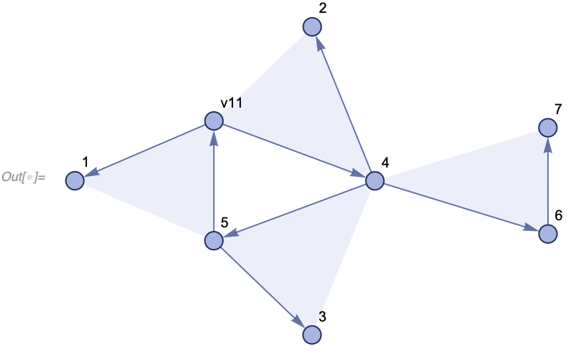
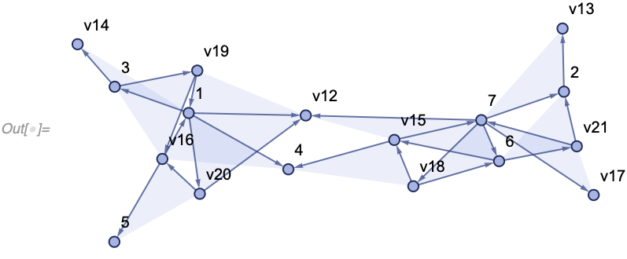

# Set Substitution System

## Basic Example

**SetReplace** is a [Wolfram Language](https://www.wolfram.com/language/) package to manipulate set substitution systems. To understand what a set substitution system does consider an unordered set of elements:
```
{1, 2, 5, 3, 6}
```
We can set up an operation on this set which would take any of the two elements and replace them with their sum:
```
{a_, b_} :> {a + b}
```
In **SetReplace**, this can be expressed as (the new element is put at the end)
```
In[] := SetReplace[{1, 2, 5, 3, 6}, {a_, b_} :> {a + b}]
Out[] = {5, 3, 6, 3}
```
Note that this is similar to `SubsetReplace` function of Wolfram Language (which did not exist prior to version 12.1, and which by default replaces all non-overlapping subsets at once)
```
In[] := SubsetReplace[{1, 2, 5, 3, 6}, {a_, b_} :> Sequence[a + b]]
Out[] = {3, 8, 6}
```

## Relations between Set Elements

A more interesting case (and the only case we have studied with any reasonable detail) is the case of set elements that are related to each other. Specifically, the elements can be expressed as ordered lists of atoms (or vertices), and the set essentially becomes an ordered hypergraph.

As a simple example consider a set
```
{{1, 2, 3}, {2, 4, 5}, {4, 6, 7}}
```
which we can render as a collection of ordered hyperedges:
```
In[] := HypergraphPlot[{{1, 2, 3}, {2, 4, 5}, {4, 6, 7}},
 VertexLabels -> Automatic]
```


We can then have a rule which would pick a subset of expressions related in a particular way (much like a join query) and replace them with something else. Note the [`Module`](https://reference.wolfram.com/language/ref/Module.html) on the right-hand side creates a new variable (vertex) which causes the hypergraph to grow.
```
{{v1_, v2_, v3_}, {v2_, v4_, v5_}} :>
 Module[{v6}, {{v5, v6, v1}, {v6, v4, v2}, {v4, v5, v3}}]
```
After a single replacement we get this (note the new vertex)
```
In[] := HypergraphPlot[
 SetReplace[{{1, 2, 3}, {2, 4, 5}, {4, 6,
    7}}, {{v1_, v2_, v3_}, {v2_, v4_, v5_}} :>
   Module[{v6}, {{v5, v6, v1}, {v6, v4, v2}, {v4, v5, v3}}]],
 VertexLabels -> Automatic]
```


After 10 steps, we get a more complicated structure
```
In[] := HypergraphPlot[
 SetReplace[{{1, 2, 3}, {2, 4, 5}, {4, 6,
    7}}, {{v1_, v2_, v3_}, {v2_, v4_, v5_}} :>
   Module[{v6}, {{v5, v6, v1}, {v6, v4, v2}, {v4, v5, v3}}], 10],
 VertexLabels -> Automatic]
```


And after 100 steps, it gets even more complicated
```
In[] := HypergraphPlot[
 SetReplace[{{1, 2, 3}, {2, 4, 5}, {4, 6,
    7}}, {{v1_, v2_, v3_}, {v2_, v4_, v5_}} :>
   Module[{v6}, {{v5, v6, v1}, {v6, v4, v2}, {v4, v5, v3}}], 100]]
```


Exploring the models of this more complicated variety is what this package is mostly designed for.

# Getting Started

## Prerequisites

To start using `SetReplace` you only need two things.

* [Wolfram Language 12.1+](https://www.wolfram.com/language/) including [WolframScript](https://www.wolfram.com/wolframscript/). A free (although not open-source) version is available as [Wolfram Engine](https://www.wolfram.com/engine/).
* A C++ compiler to build the low-level part of the package. Instructions on how to setup a compiler to use in WolframScript in various platforms are [available](https://reference.wolfram.com/language/CCompilerDriver/tutorial/SpecificCompilers.html#509267359).

## Build Instructions

To build,
1. `cd` to the root directory of the repository.
2. Run `./build.wls` to create the paclet file.
If you see an error message about c++17, make sure the C++ compiler you are using is up-to-date. If your default system compiler does not support c++17, you can choose a different one with environmental variables. The following, for instance, typically works on a Mac:
```
COMPILER=CCompilerDriver\`ClangCompiler\`ClangCompiler COMPILER_INSTALLATION=/usr/bin ./build.wls
```
Here `ClangCompiler` can be replaced with one of `"Compiler" /. CCompilers[Full]` (run ``<< CCompilerDriver` `` to use `CCompilers`), and `COMPILER_INSTALLATION` is a directory in which the compiler binary can be found.

3. Run `./install.wls` to install the paclet into your Wolfram system.
4. Evaluate `PacletDataRebuild[]` in all running Wolfram kernels.
5. Evaluate ``<< SetReplace` `` every time prior to using package functions.

A less frequently updated version is available through the Wolfram's public paclet server and can be installed by running `PacletInstall["SetReplace"]`.

## Fundamental Physics

A hypothesis is that space-time at the fundamental Planck scale might be represented as a network that can be produced by a system similar to the one this package implements.

This idea was first proposed in Stephen Wolfram's [A New Kind Of Science](https://www.wolframscience.com/nks/chap-9--fundamental-physics/).

The system here is not the same (the matching algorithm does not constrain vertex degrees), but it follows the same principles.

## C++ | Wolfram Language Implementations

There are two implementations available: one written in Wolfram Language, one in C++.

The Wolfram Language implementation permutes `SetReplace` rules in all possible ways and uses `Replace` a specified number of times to perform evolution. This works well for small graphs and small rule inputs, but it slows down with the number of edges in the graph and has exponential complexity in rule size.

The C++ implementation, on the other hand, keeps an index of all possible rule matches and updates it after every step. The reindexing algorithm looks only at the local region of the graph close to the rewrite site, thus time complexity does not depend on the graph size as long as vertex degrees are small. The downside is that it has exponential complexity (both in time and memory) in the vertex degrees. Currently, it also does not work for non-local rules (i.e., rule inputs that do not form a connected graph), although one can imagine ways to implement that.

So, in summary C++ implementation `Method -> "C++"` should be used if:
1. Vertex degrees are expected to be small.
2. Evolution needs to be done for a large number of steps `> 100`, it is possible to produce graphs with up to `10^6` edges or more.

It should not be used, however, if vertex degrees can grow large. For example
```
In[.] := SetReplace[{{0}},
  FromAnonymousRules[{{{0}} -> {{0}, {0}, {0}}, {{0}, {0}, {0}} -> {{0}}}], 30];
```
takes 3.25 seconds in C++ implementation, and less than 1 millisecond in the Wolfram Language implementation.

On the other hand, Wolfram Language implementation `Method -> "WolframLanguage"` should be used if:
1. A large number and variety of rules need to be simulated for a small number of steps.
2. Vertex degrees are expected to be large, or rules are non-local.

There are unit tests, but if you spend time studying a particular rule in detail, it is a good idea to evaluate it with both C++ and Wolfram Language implementations and check the results are the same. If results are different, create an issue, and assign `bug` and `P0` tags to it.

## Other Functions

There are other functions available, such as `SetReplaceAll`, `SetReplaceFixedPoint` and `SetReplaceList`. Only Wolfram Language implementations are available for these at the time. They all have usage strings, so just run
```
In[.] := ?SetReplace`*
```


to see the full list and explore.

## Rules with Complex Behaviors

One example of an interesting system (credit to Stephen Wolfram) is
```
In[.] := GraphPlot[
 UndirectedEdge @@@
  SetReplace[{{0, 0}, {0, 0}, {0, 0}},
   FromAnonymousRules[{{0, 1}, {0, 2}, {0, 3}} -> {{4, 5}, {5, 4}, {4,
        6}, {6, 4}, {5, 6}, {6, 5}, {4, 1}, {5, 2}, {6, 3}, {1,
       6}, {3, 4}}], 10000]]
```


A smaller system that still appears complex is
```
In[.] := GraphPlot[
 neat2 = Graph[
   DirectedEdge @@@
    SetReplace[{{0, 0}, {0, 0}, {0, 0}},
     FromAnonymousRules[{{0, 1}, {0, 2}, {0, 3}} -> {{1, 6}, {6,
         4}, {6, 5}, {5, 6}, {6, 3}, {3, 4}, {5, 2}}], 10000]]]
```


Curiously, it produces planar graphs
```
In[.] := PlanarGraphQ[neat2]
```
```
Out[.] = True
```
